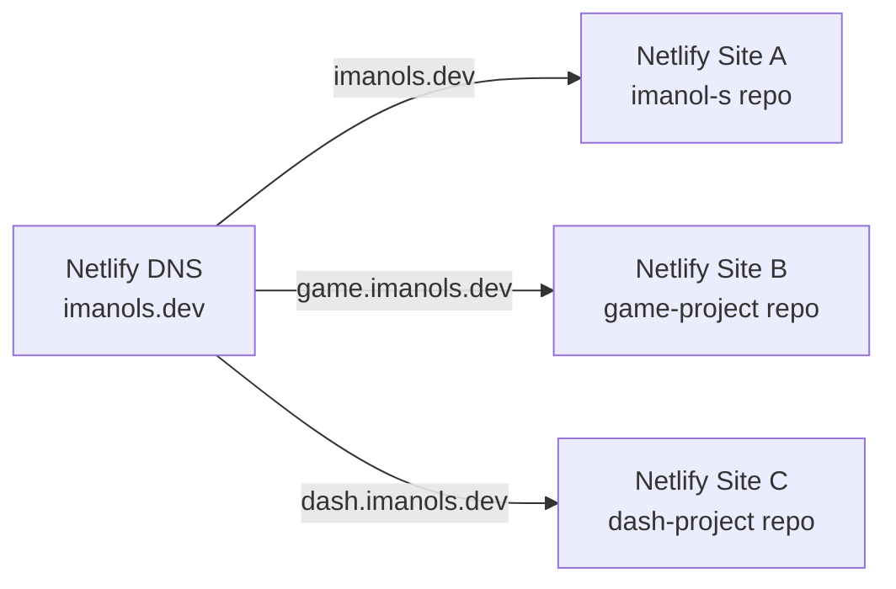

# Netlify Subdomain Infrastructure

## How Subdomains Work on Netlify

Each subdomain serving different content (e.g., `game.imanols.dev`) must be its own **separate Netlify site**, connected to its own repo. One Netlify site cannot serve different builds for different subdomains.

**Recommended architecture: separate repos, not monorepo.** Each project likely uses different tech stacks and deploys independently. A monorepo adds build complexity (selective ignores, shared workspace config) with no real benefit for a portfolio.

## Current DNS Status

**Netlify DNS is already active for `imanols.dev`.** No delegation steps are needed — the domain is fully managed by Netlify with `NETLIFY` and `NETLIFYv6` record types.

| Name | TTL | Type | Value |
|------|-----|------|-------|
| `imanols.dev` | 3600 | NETLIFY | `imanols-dev.netlify.app` |
| `www.imanols.dev` | 3600 | NETLIFY | `imanols-dev.netlify.app` |
| `imanols.dev` | 3600 | NETLIFYv6 | `imanols-dev.netlify.app` |
| `www.imanols.dev` | 3600 | NETLIFYv6 | `imanols-dev.netlify.app` |

Since full DNS delegation is already in place, adding subdomains is straightforward — Netlify auto-creates DNS records and provisions wildcard SSL when you assign a subdomain to a site.

Ref: [Set up Netlify DNS](https://docs.netlify.com/manage/domains/set-up-netlify-dns/) | [Delegate a standalone subdomain](https://docs.netlify.com/manage/domains/configure-domains/delegate-a-standalone-subdomain/)

## Adding a New Subdomain Project

1. Create a new GitHub repo for the project.
2. Create a new Netlify site in the dashboard, connect the repo.
3. In the new site's **Domain management** panel, select **Add a domain**, enter `project-name.imanols.dev`.
4. Select **Verify**, then **Add subdomain**.
5. Netlify auto-creates the DNS record under `imanols.dev` and provisions the SSL certificate.
6. Wait up to 48 hours for propagation (usually much faster). Verify with `dig project-name.imanols.dev` or [DNSChecker](https://dnschecker.org/).

After setup, the new record will appear alongside the existing ones as a `NETLIFY` / `NETLIFYv6` entry pointing to `your-project.netlify.app`.

## Free Tier Budget

No hard limit on number of sites. The constraint is **300 credits/month** shared across all sites (~300 build minutes, ~100 GB bandwidth). A portfolio with 3-5 small static project sites will stay well within this.
