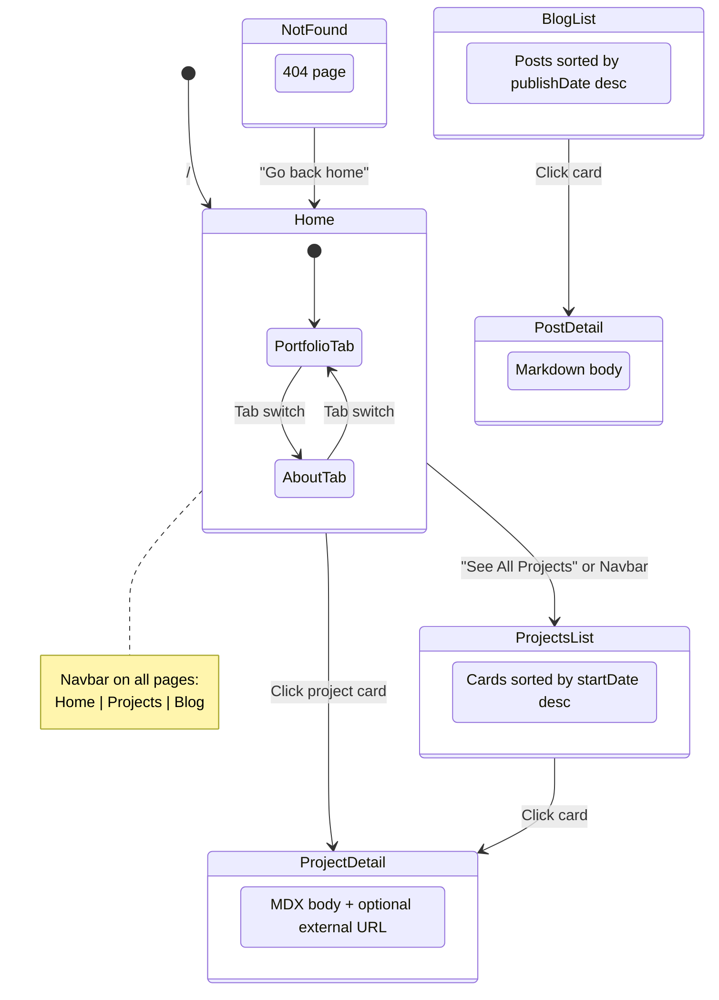

# Site Structure

Navigation state diagram and page-to-component mapping for the portfolio site.

## State Diagram



## Page → Component Tree

```
/ (index.astro)
├── ProfileInfo, ProfileImage
├── ProfileFacts
├── ProfileActionButton        → CV download, mailto
└── TabsButtons (React)        → client:visible hydration
    ├── slot="portfolio" → ProjectsCC
    │   ├── ProjectCard[]      → links to /projects/[id]
    │   └── "See All Projects" → links to /projects
    └── slot="about" → AboutMeCC
        ├── JobDetails         → data from Jobs.ts
        ├── EduDetail          → data from education.ts
        └── SkillCard          → data from hardSkills.ts, softSkills.ts, languages.ts

/projects (projects/index.astro)
└── ProjectCardList[]          → links to /projects/[id]

/projects/[id] (projects/[id].astro)
├── BackBtn                    → history.back()
├── Image (view transition)
├── <Content/> (rendered MDX)
└── BackToTop

/blog (blog/index.astro)
└── PostCard[]                 → links to /blog/[id]

/blog/[id] (blog/[id].astro)
├── BackBtn                    → history.back()
├── Image (view transition)
├── <Content/> (rendered MD)
└── BackToTop

404 (404.astro)
└── "Go back home"             → links to /
```

## Shared Across All Pages

- `Layout.astro` — wraps every page (see `../CLAUDE.md` for SEO/styling details)
- `Navbar.astro` — fixed top nav; links defined in `src/data/menu.ts`
- `Footer.astro` — template credit
