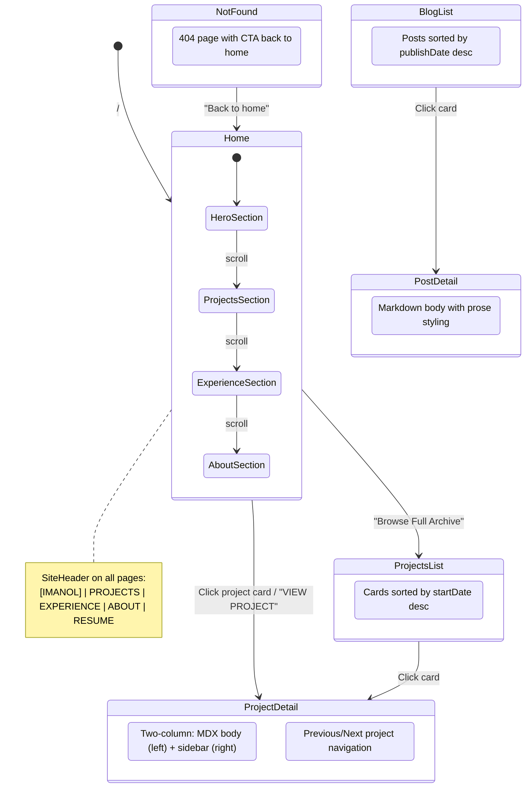

# Site Structure

Navigation state diagram and page-to-component mapping for the portfolio site.

## State Diagram



## Page → Component Tree

```
/ (index.astro)
├── TypewriterText (React)    → client:load hydration, hero name animation
├── Hero section              → subtitle, blurb, 3 capability tiles
├── Portrait                  → <Image> with cad-border, social icon links
├── Projects section          → horizontal-scroll-snap cards from content collection
│   └── Project cards         → cover image, title, summary, VIEW PROJECT CTA
├── Experience section
│   ├── Timeline (left)       → data from Jobs.ts (2 jobs) + education.ts
│   └── Tech Specs (right)    → Core Languages, Competencies, Communication
└── About section             → blurb, location tile, contact tile

/projects (projects/index.astro)
└── Project list cards[]      → cover image, tags, title, summary → links to /projects/[id]

/projects/[id] (projects/[id].astro)
├── Breadcrumb                → ← Projects (links to /#projects)
├── Project label             → PROJECT_01, PROJECT_02, etc.
├── Title + tag pills
├── Hero image                → <Image> with cad-border, grayscale
├── Two-column body
│   ├── Left (8/12)           → Overview label + summary + <Content/> in .project-mdx
│   └── Right (4/12)          → Links (if url valid) + Stack pills + Timeline
└── Prev/Next navigation

/blog (blog/index.astro)
└── PostCard[]                → links to /blog/[id]

/blog/[id] (blog/[id].astro)
├── BackBtn                   → history.back()
├── Image (view transition)
├── <Content/> (rendered MD in .prose)
└── BackToTop

404 (404.astro)
└── "Back to home"            → links to /
```

## Shared Across All Pages

- `Layout.astro` — wraps every page: SEO head, font preloads, dark mode init, TopoBackground, SiteHeader, SiteFooter
- `SiteHeader.astro` — sticky top nav with [IMANOL] logo, section links, RESUME download, mobile hamburger
- `SiteFooter.astro` — "Ready to construct?" CTA, email, GitHub/LinkedIn icons, copyright
- `TopoBackground.tsx` — React island: animated SVG contours (before header in DOM)

## Data Flow

- **Project cards on home page**: `getCollection('projects')` sorted by startDate desc
- **Project detail**: `getStaticPaths()` generates one page per MDX file in `src/content/projects/`
- **Experience timeline**: imported from `src/data/Jobs.ts` (first 2 entries) + `src/data/education.ts`
- **Contact/Social**: sourced from `src/config.ts` (`ME.contactInfo`, `SOCIALS`)
- **Blog**: `getCollection('posts')` sorted by publishDate desc
