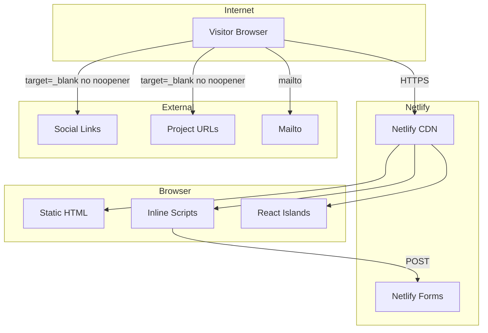

# Threat Model: imanol-s Portfolio

**Repository:** `/Users/imanol/Documents/Projects/imanol-s`
**Generated:** 2026-02-23
**Scope:** Full repository (production runtime)

---

## Executive Summary

This is a static personal portfolio built with Astro 5, deployed to Netlify with no server-side processing at runtime. The attack surface is minimal: no authentication, no user input at runtime, no database, and no secrets. The highest-priority finding is **missing `rel="noopener noreferrer"` on external links** (`Social.astro:17`, `projects/[id].astro:40-42`), which exposes visitors to tabnabbing attacks. All other risks are low given the static nature of the site and the absence of attacker-controlled content injection paths.

---

## Scope and Assumptions

### In-scope

- All runtime code under `src/` (pages, components, layouts, content collections)
- Build configuration (`astro.config.mjs`, `tailwind.config.mjs`, `tsconfig.json`)
- Static content in `src/content/` (projects, posts)
- Client-side scripts inline in Astro components

### Out-of-scope

- `.github/` templates (no CI/CD workflows present)
- `node_modules/`, build artifacts
- Netlify platform infrastructure
- Third-party dependencies (dependency audit out of scope)

### Assumptions

| Assumption                                                   | Impact if wrong                                                    |
| ------------------------------------------------------------ | ------------------------------------------------------------------ |
| Site is deployed as static files only (no Netlify Functions) | If Functions added, attack surface expands significantly           |
| All MDX/MD content authored by site owner                    | If untrusted authors gain write access, XSS via MDX becomes viable |
| No secrets or API keys in repo                               | Confirmed via search; if added, could leak via git history         |
| Netlify auto-build from main branch                          | If build process is compromised, supply chain attack possible      |

### Open Questions

- None remaining (all clarified with user)

---

## System Model

### Primary Components

| Component               | Description                                        | Evidence                                                          |
| ----------------------- | -------------------------------------------------- | ----------------------------------------------------------------- |
| **Astro SSG**           | Static site generator, outputs HTML/CSS/JS         | `astro.config.mjs:14`                                             |
| **Page Routes**         | File-based routing: `/`, `/blog`, `/projects/[id]` | `src/pages/*.astro`                                               |
| **Content Collections** | Type-safe MDX/MD content with Zod schemas          | `src/content/config.ts:8-37`                                      |
| **React Islands**       | Single hydrated component: `TabsButtons.tsx`       | `src/pages/index.astro:16` (`client:visible`)                     |
| **Inline Scripts**      | Client-side JS for command palette, share, nav     | `CommandPalette.astro:127-396`, `ShareProjectButton.astro:29-144` |
| **Netlify Forms**       | Passive event tracking via hidden form             | `Layout.astro:76-85`                                              |

### Data Flows and Trust Boundaries

```
Internet (Visitor Browser)
    │
    ▼ [HTTPS, no auth]
┌─────────────────────────────────────┐
│  Netlify CDN (Static Files)         │
│  - HTML, CSS, JS, images, PDFs      │
└─────────────────────────────────────┘
    │
    ▼ [No boundary - static delivery]
┌─────────────────────────────────────┐
│  Visitor Browser                    │
│  - Renders HTML/CSS                 │
│  - Executes inline scripts          │
│  - Hydrates TabsButtons.tsx         │
└─────────────────────────────────────┘
    │
    ├──▶ External Social Links (GitHub, LinkedIn) [HTTP → external, no noopener]
    ├──▶ External Project URLs [HTTP → external, no noopener]
    ├──▶ Mailto: links [opens email client]
    └──▶ Netlify Forms [POST /, beacon] - analytics tracking
```

| Boundary                 | Data Types                              | Protocol                | Security Controls                 | Validation              |
| ------------------------ | --------------------------------------- | ----------------------- | --------------------------------- | ----------------------- |
| Internet → Netlify CDN   | HTTP requests for static assets         | HTTPS                   | TLS 1.2+, Netlify edge            | N/A (static)            |
| Browser → External Links | Navigation, referrer                    | HTTP/HTTPS              | **Missing `noopener noreferrer`** | None                    |
| Browser → Netlify Forms  | Event name, path, timestamp, UTM params | HTTPS POST / sendBeacon | Netlify form handling             | None (passive tracking) |
| Build Time → Content     | MDX/MD files, frontmatter               | File system             | Zod schema validation             | `src/content/config.ts` |

### Diagram



---

## Assets and Security Objectives

| Asset                                       | Why it Matters                                            | Objective                  |
| ------------------------------------------- | --------------------------------------------------------- | -------------------------- |
| **Personal Info** (email, LinkedIn, GitHub) | Owner's contact details and professional identity         | Integrity, Availability    |
| **Resume PDF**                              | Downloadable CV with potentially sensitive work history   | Integrity                  |
| **Project/Blog Content**                    | Owner's intellectual property and professional reputation | Integrity                  |
| **Site Availability**                       | Portfolio is primary professional presence                | Availability               |
| **Visitor Trust**                           | Visitors expect safe navigation without being exploited   | Integrity, Confidentiality |
| **Netlify Form Data**                       | Analytics data (paths, UTM params) stored by Netlify      | Integrity                  |

---

## Attacker Model

### Capabilities

- **Remote unauthenticated visitor**: Can browse all public pages, trigger client-side scripts, follow external links
- **Man-in-the-middle on visitor network**: Can observe unencrypted traffic (mitigated by HTTPS)
- **Social engineer**: Can craft phishing pages that exploit missing `noopener` to tabnab

### Non-capabilities

- Cannot inject content into the site (static, build-time only)
- Cannot authenticate or escalate privileges (no auth system)
- Cannot access server-side resources (no server runtime)
- Cannot modify build process (Netlify-controlled)
- Cannot directly attack the site owner's systems through the portfolio

---

## Entry Points and Attack Surfaces

| Surface               | How Reached           | Trust Boundary     | Notes                          | Evidence                                               |
| --------------------- | --------------------- | ------------------ | ------------------------------ | ------------------------------------------------------ |
| Static Pages          | HTTP GET to any route | Internet → CDN     | Read-only, no input            | `src/pages/*.astro`                                    |
| External Social Links | Click social icons    | Browser → External | Missing `noopener noreferrer`  | `Social.astro:17`                                      |
| External Project URLs | Click project link    | Browser → External | Missing `noopener noreferrer`  | `projects/[id].astro:40-42`                            |
| Resume Download       | Click CV button       | Browser → CDN      | Opens new tab without noopener | `ProfileActionButton.astro:34`                         |
| Netlify Form          | Page load/share event | Browser → Netlify  | Passive tracking, no user data | `Layout.astro:76-85`, `ShareProjectButton.astro:32-54` |
| Command Palette       | Keyboard shortcut     | Browser only       | Client-side navigation only    | `CommandPalette.astro:127-396`                         |

---

## Top Abuse Paths

1. **Tabnabbing via Social Links**
   - Attacker goal: Phish visitors via compromised external site
   - Steps: Visitor clicks social icon → opens external site in new tab → attacker site modifies `window.opener` → redirects original tab to phishing page → visitor enters credentials
   - Impact: Credential theft, reputation damage

2. **Tabnabbing via Project Links**
   - Attacker goal: Phish visitors via compromised project URL
   - Steps: Visitor clicks "Visit the project" → opens external site → same tabnabbing attack
   - Impact: Credential theft, reputation damage

3. **Malicious Resume PDF (Supply Chain)**
   - Attacker goal: Distribute malware via PDF
   - Steps: Compromise Netlify build or `public/Saldana.Resume.pdf` → visitors download infected PDF
   - Impact: Malware infection, reputation damage

4. **Content Integrity via MDX Injection (Requires Build Access)**
   - Attacker goal: Execute XSS in visitor browser
   - Steps: Gain write access to `src/content/` → inject malicious MDX → build deploys XSS → visitors execute payload
   - Impact: Session hijacking, phishing

5. **Netlify Form Spam/Abuse**
   - Attacker goal: Pollute analytics or waste resources
   - Steps: Automated POST requests to `/` with form data → Netlify processes spam submissions
   - Impact: Analytics pollution, potential cost

---

## Threat Model Table

| ID     | Threat Source                             | Prerequisites                         | Threat Action                               | Impact                        | Impacted Assets                  | Existing Controls        | Gaps                                | Recommended Mitigations                                                                | Detection Ideas                              | Likelihood | Impact Severity | Priority   |
| ------ | ----------------------------------------- | ------------------------------------- | ------------------------------------------- | ----------------------------- | -------------------------------- | ------------------------ | ----------------------------------- | -------------------------------------------------------------------------------------- | -------------------------------------------- | ---------- | --------------- | ---------- |
| TM-001 | Malicious external site                   | Visitor clicks social link            | Tabnabbing via `window.opener` access       | Credential theft, phishing    | Visitor Trust                    | None                     | Missing `rel="noopener noreferrer"` | Add `rel="noopener noreferrer"` to all `target="_blank"` links                         | Monitor for phishing reports                 | Medium     | Medium          | **Medium** |
| TM-002 | Malicious external site                   | Visitor clicks project URL            | Tabnabbing via `window.opener` access       | Credential theft, phishing    | Visitor Trust                    | None                     | Missing `rel="noopener noreferrer"` | Add `rel="noopener noreferrer"` to project links; use `<a>` instead of JS for external | Monitor for phishing reports                 | Low        | Medium          | **Medium** |
| TM-003 | Compromised build pipeline                | Attacker gains Netlify or repo access | Inject malicious content into static output | Malware, XSS, reputation loss | Site Availability, Visitor Trust | Netlify-controlled build | No integrity verification of output | Enable Netlify build hooks with secrets; pin dependencies; enable SRI for critical JS  | Netlify deploy logs; content hash monitoring | Low        | High            | **Medium** |
| TM-004 | Malicious insider/compromised contributor | Write access to `src/content/`        | Inject XSS via MDX components               | Session hijacking, phishing   | Visitor Trust, Content Integrity | Zod schema validation    | No sanitization of MDX output       | Review MDX content before merge; enable `astro check` in CI                            | None currently                               | Low        | Medium          | **Low**    |
| TM-005 | Bot/attacker network                      | Internet access                       | Spam Netlify form submissions               | Analytics pollution, cost     | Netlify Form Data                | Netlify form handling    | No rate limiting, no CAPTCHA        | Add Netlify reCAPTCHA if spam becomes issue; review form submissions                   | Netlify form analytics                       | Low        | Low             | **Low**    |

---

## Criticality Calibration

### Critical

_Not applicable to this repository_ - No pre-auth RCE, auth bypass, sensitive data exfiltration, or key theft possible.

### High

_Not applicable to this repository_ - No cross-tenant access, model integrity compromise, or sandbox escape possible.

### Medium

- **Tabnabbing via missing `noopener`** (TM-001, TM-002): Requires user interaction but can lead to credential theft
- **Build pipeline compromise** (TM-003): Requires significant access but high impact on visitors

### Low

- **MDX content injection** (TM-004): Requires contributor access; content is owner-controlled
- **Form spam** (TM-005): Low impact, easy to mitigate if it occurs

---

## Focus Paths for Security Review

| Path                                       | Why It Matters                                   | Related Threat IDs |
| ------------------------------------------ | ------------------------------------------------ | ------------------ |
| `src/components/Social.astro`              | External links missing `noopener noreferrer`     | TM-001             |
| `src/pages/projects/[id].astro`            | External project links missing protection        | TM-002             |
| `src/components/ProfileActionButton.astro` | `window.open()` without noopener                 | TM-001, TM-002     |
| `src/content/config.ts`                    | Zod schema validation for content integrity      | TM-004             |
| `src/layouts/Layout.astro`                 | Netlify form handling, external resource loading | TM-005             |
| `public/` directory                        | Static assets including resume PDF               | TM-003             |
| `astro.config.mjs`                         | Build configuration, integrations                | TM-003             |
| `package.json`                             | Dependency versions, scripts                     | TM-003             |

---

## Recommended Actions (Prioritized)

### 1. Fix Missing `noopener noreferrer` (TM-001, TM-002)

**Files:** `src/components/Social.astro:17`, `src/pages/projects/[id].astro:40-42`

```diff
# Social.astro
- target="_blank"
+ target="_blank" rel="noopener noreferrer"

# [id].astro
- <a href={url}>
+ <a href={url} target="_blank" rel="noopener noreferrer">
```

**Also fix:** `src/components/ProfileActionButton.astro:34`

```javascript
// Change from:
window.open(resume, "_blank");
// To:
window.open(resume, "_blank", "noopener,noreferrer");
```

### 2. Add Integrity Checks for Build (TM-003)

- Pin all dependency versions in `package.json` (remove `^` ranges)
- Enable Dependabot for security updates
- Review Netlify deploy notifications for unexpected changes

### 3. Content Review Process (TM-004)

- Ensure MDX content is reviewed before merging
- Consider enabling `astro check` as a required status check if CI is added

---

## Quality Check

| Check                            | Status                                                   |
| -------------------------------- | -------------------------------------------------------- |
| All entry points covered         | ✅ Pages, external links, forms, command palette         |
| All trust boundaries represented | ✅ Internet→CDN, Browser→External, Browser→Netlify       |
| Runtime vs CI/dev separation     | ✅ CI limited to Netlify auto-build; no custom workflows |
| User clarifications reflected    | ✅ Deployment, CI/CD, data sensitivity confirmed         |
| Assumptions explicit             | ✅ Listed in Scope and Assumptions section               |
| Format matches template          | ✅ Follows required output format                        |
