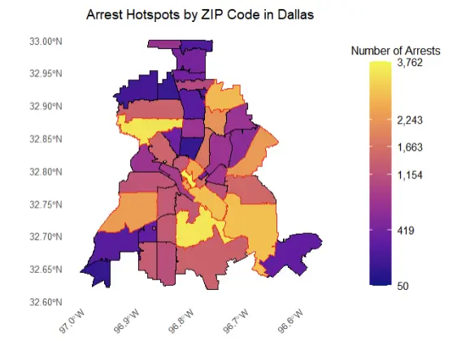

## Table of Contents

1. [Overview](#overview)
2. [Role](#role)
3. [Problem](#problem)
4. [Goal](#goal)
5. [Solution](#solution)

---

## Overview

Statistical analysis of 50k+ crime/housing records to identify trends. Analyzing the relationship between _arrests_ and _property types_ to determine if a correlation exists between pricing and housing cost.

---

## 👨‍💻 Role

**Developer**

---

## ❓ Problem

1. Lack of data-driven understanding of crime's economic impacts
2. Stakeholders need reliable data for predictive insights
3. Understanding if the Statistical analysis performed is accurate
4. Housing data is sparse and often requires payment

---

## 🎯 Goal

1. Determine safest location to reside in Dallas, Tx.
2. Empower users to make informed life decisions with intuitive visualizations such as shape maps
3. Determine arrest hotspots per zip-code

---

## ✨ Solution

- Identify statistically significant crime/housing price relationships
- Automated data cleaning workflows for 50k+ records
- Implement DFW Map with hotspot visualizations automated using R
- Communicate findings to non-technical stakeholders

---
