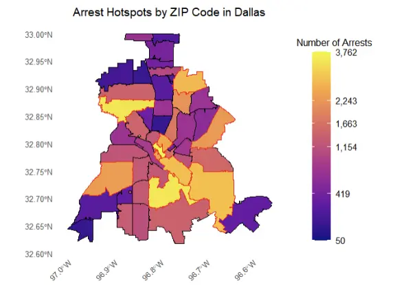

## Overview

This project started as a group analysis in Fall 2024, built around a straightforward hypothesis: that crime rates in Dallas zip codes would correlate meaningfully with housing prices. Two datasets were joined at the zip-code level — Dallas Police Department arrest records (`Police_Arrests.csv`, ~50k incidents with arrest zip codes) and Zillow Dallas housing listings (`Zillow-dallas.csv`, property prices keyed by zip). Cleaning, aggregation, and joins were handled in R with `dplyr`; visualizations used `ggplot2`.

The original analysis produced per-zip arrest counts, average and median property prices, and a merged summary table (`Dallas_Arrests_Property_Summary.csv`). A scatter plot of total arrests vs. average property price per zip showed a visible trend, and a shape map highlighted arrest hotspots across the DFW area.

## 2026 Remediation

In March 2026, I circled back to this project with better analytical tools and reperformed the regression analysis. The parsimonious model achieved an R² of 0.854, confirming that education level, listing price, and market pressure explain most of the variance in housing prices. Crime rate ranked 98th out of 141 features in the factor importance analysis — a weak predictor at best.

This contradicted the original project's implicit assumption that crime would be a dominant factor. The honest finding is that crime has minimal independent explanatory power once socioeconomic and market variables are accounted for. The shape map still has value as a geographic visualization of arrest density, but the causal story the original project was built around does not hold up under a properly specified model.

## Role

Developer (Group Project — Fall 2024), sole analyst on the 2026 remediation.

## What I Learned

The original analysis suffered from omitted variable bias — correlating two variables without controlling for confounders that drive both. Revisiting the project two years later with a multivariate approach produced a materially different conclusion. The 2026 remediation is the more defensible analysis; the 2024 version is preserved in the repository as a record of where the work started.
